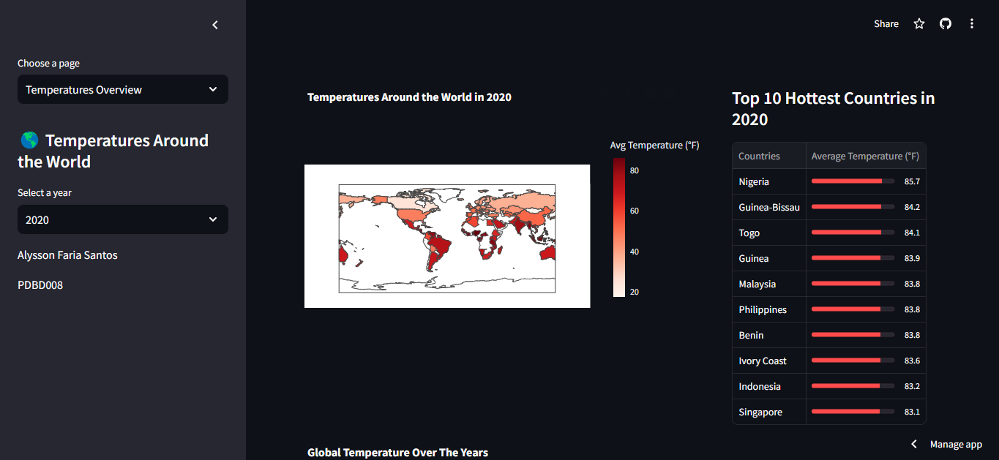
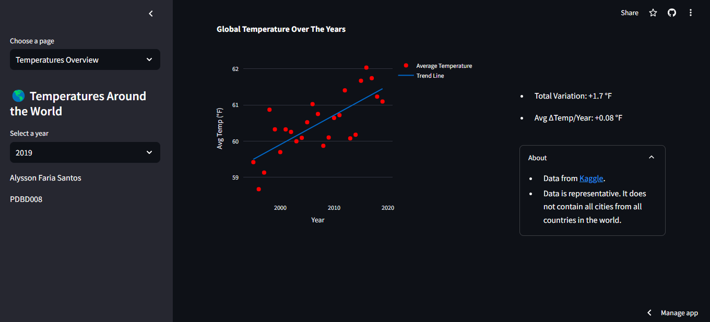
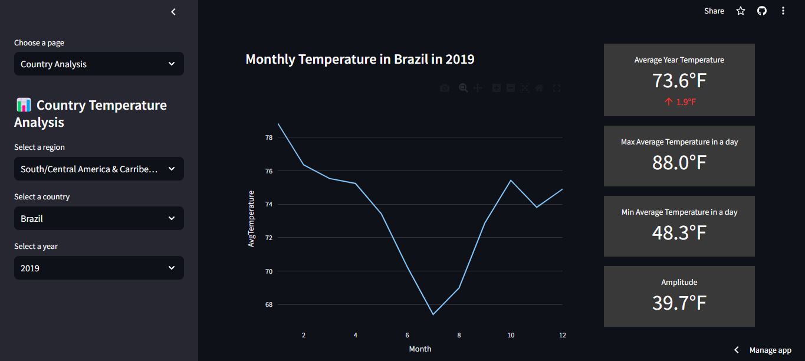

# Temperature Dashboard

<body>
  <h3>This project consists of a dashboard about temperatures in different places around the world. It was developed as part of the Challenges I Course of Projeto Desenvolve - Bom Despacho </h3>
  <h4>The Dashboard contains 2 main pages:</h4>
  <ul>
    <li>Temperatures Overview:</li>
    
    
    
This page contains general data about the global temperature over the years, its total and average variation and a list of the top 10 hottest country in the selected year. 

    <li>
      Country Analysis:
    </li>
    
    
This section shows detailed data about the temperature in a specific country during a year. The dropdown menu on the left allows the user to choose a region, a country within the selected region and the year the user wants to see the data about.

  </ul>
  

    This dashboard was developed using Python as its main language. The frameworks and libraries used were:
    <ul>
      <li><a href= 'https://streamlit.io/' target="_blank">Streamlit</a></li>
      <li><a href= 'https://pandas.pydata.org/'>Pandas</a></li>
      <li><a href= 'https://plotly.com/'>Plotly</a></li>
      <li><a href= 'https://numpy.org/'>Numpy</a></li>
    </ul>
  

  

    
The database used is a CSV file downloaded from <a href= 'https://www.kaggle.com/datasets/sudalairajkumar/daily-temperature-of-major-cities'>Kaggle</a>.

    
The dashboard is deployed by Streamlit Sharing. To access it, <a href='https://temperaturedashboard.streamlit.app/'>click here</a>.

  

</body>
